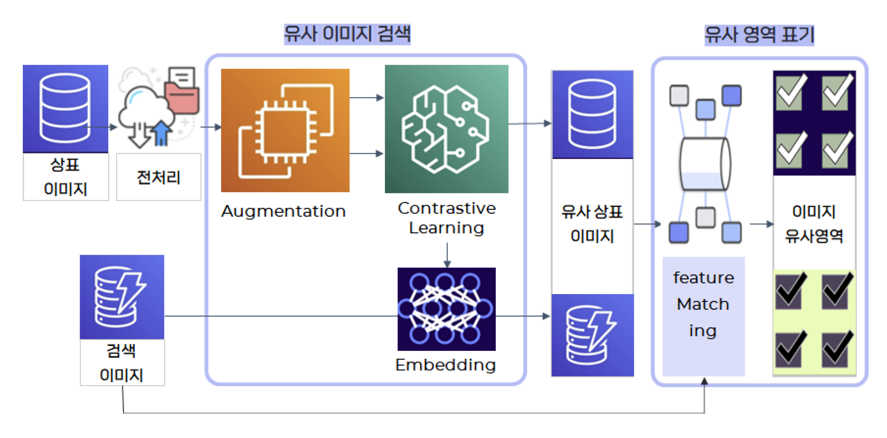
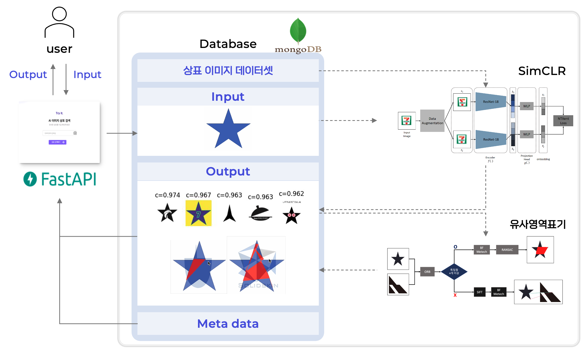

<b>

  상표 이미지 유사도 검색 서비스  🔍

</b>

  

### 💻 Introduction

> “상표 출원자가 마주치는 어려움 증가"
- ❗️상표 출원 건수의 증가와 유사 상표 위반 사례의 증가
- ❗️ 유사 상표 등록, 충돌, 저작권 침해 등으로 인한 출원 거절
- ❗️기존 상표 검색 방법의 한계와 유사 상표 위반 탐지의 어려움

<!-- ### 핵심 기능 -->

  
### 🛠️Settings
|||
|------|---|
|개발 목표|**AI 모델**을 활용한 효율적인 상표 검색 서비스 구현|
|개발 인원|모델 3명, 시스템 2명|
|개발 환경| **Language**: python, javascript  **Framework**: mongoDB, fastAPI, figma|

  

### 📚 References
**similarity**: IRT, SimSiam, SimCLR  **ranking**: ORB+RANSAC, SIFT

  
### 📌 About model

#### 1. 상표 데이터

#### 2. 유사 이미지 검색

#### 3. 유사 영역 표기

  
### 📌 About system
### ⚙️ Service Architecture

 

